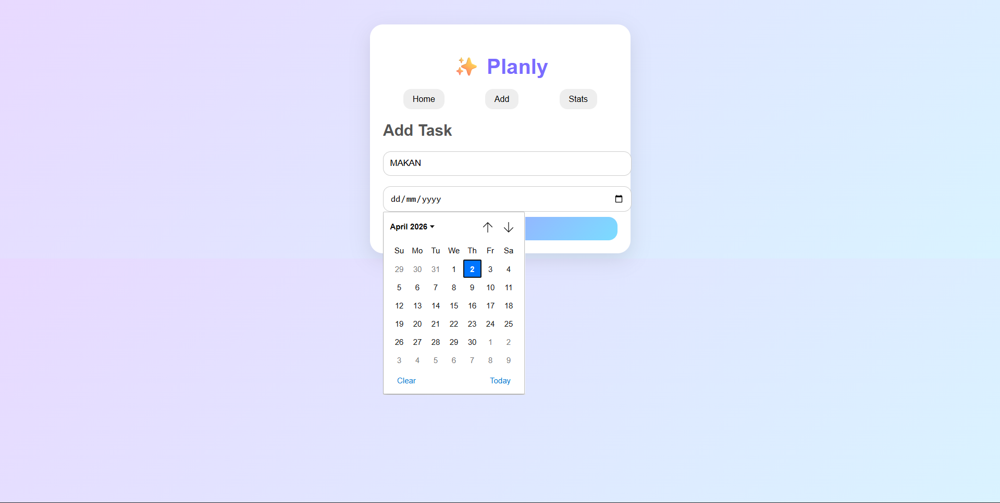
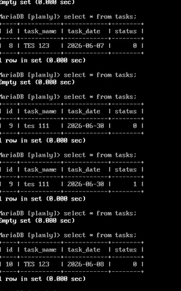
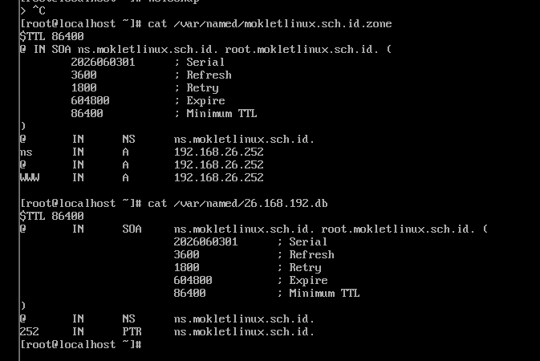

# PORTOFOLIO & DOKUMENTASI PROYEK TKJ - Nibras Nafis

Selamat datang di repositori dokumentasi proyek praktikum administrasi sistem dan jaringan saya selama menempuh pendidikan di SMK Telkom Malang. Repositori ini memuat implementasi sistem operasi server, manajemen basis data, dan integrasi multi-platform dalam jaringan lokal.

---

##  Proyek 1: Deploy Aplikasi Web dan Integrasi Database Server via Linux

* **Peran:** System Administrator / DevOps Junior
* **Tools:** Linux Server, MariaDB (MySQL), Web Server

### Deskripsi Singkat
Melakukan deployment aplikasi web pada sistem operasi Linux Server dan mengonfigurasinya agar dapat terhubung dengan database server MariaDB. Proyek ini bertujuan untuk membangun infrastruktur server lokal yang stabil, aman, dan siap menangani lalu lintas data aplikasi secara real-time.

### Tantangan & Solusi
* **Tantangan:** Aplikasi web gagal terhubung dengan sistem database karena *service* database belum terintegrasi di dalam lingkungan server Linux yang sama.
* **Solusi:** Melakukan instalasi, konfigurasi, dan pengamanan database server MariaDB langsung di dalam sistem operasi Linux, serta menyesuaikan konfigurasi *database connection* pada aplikasi.

### Hasil & Dampak
Aplikasi web berhasil diakses oleh perangkat lain dalam jaringan secara lancar. Fitur unggah data/tugas pada aplikasi "Planly" berfungsi 100% dengan transaksi data yang langsung tersimpan secara *real-time* ke dalam tabel database MariaDB.

### Bukti Dokumentasi
Berikut adalah tampilan antarmuka aplikasi "Planly" dan isi tabel database MariaDB setelah dilakukan transaksi input data:

---

##  Proyek 2: Integrasi Server Multi-Platform (Linux & Windows Server) untuk Layanan Web

* **Peran:** Network & System Administrator Junior
* **Tools:** Linux Server, Windows Server 2022, Active Directory, DNS Server

### Deskripsi Singkat
Membangun dan mengintegrasikan infrastruktur server multi-platform yang menggabungkan Linux Server (sebagai penyedia service web) dan Windows Server. Proyek ini bertujuan agar seluruh perangkat client di dalam jaringan dapat mengakses layanan website yang di-host di server Linux secara aman dan lancar melalui perantaraan manajemen jaringan Windows Server.

### Tantangan & Solusi
* **Tantangan:** Perangkat *client* mengalami kegagalan resolusi nama domain (tidak dapat mengakses web server menggunakan nama domain/DNS).
* **Solusi:** Melakukan konfigurasi ulang dan pemetaan *Active Directory Domain Services* serta DNS Server pada Windows Server agar dapat mengarahkan *request domain* ke IP Address *web server* Linux secara tepat.

### Hasil & Dampak
Layanan website yang berdiri di atas Linux Server berhasil diakses oleh perangkat client secara real-time tanpa ada error connection timeout.

### Bukti Dokumentasi
Berikut adalah hasil pengujian konektivitas ping stabil (0% loss) dari Windows Server menuju ke IP server Linux:

